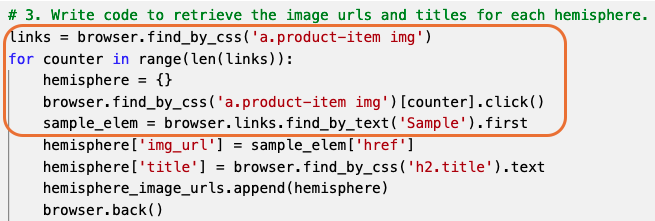
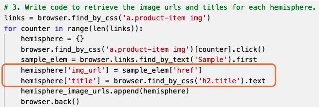
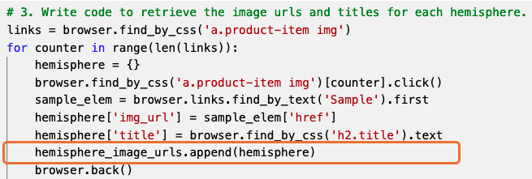
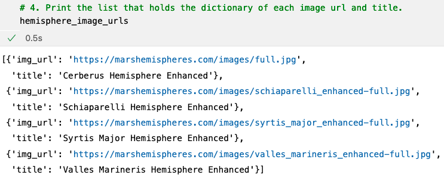
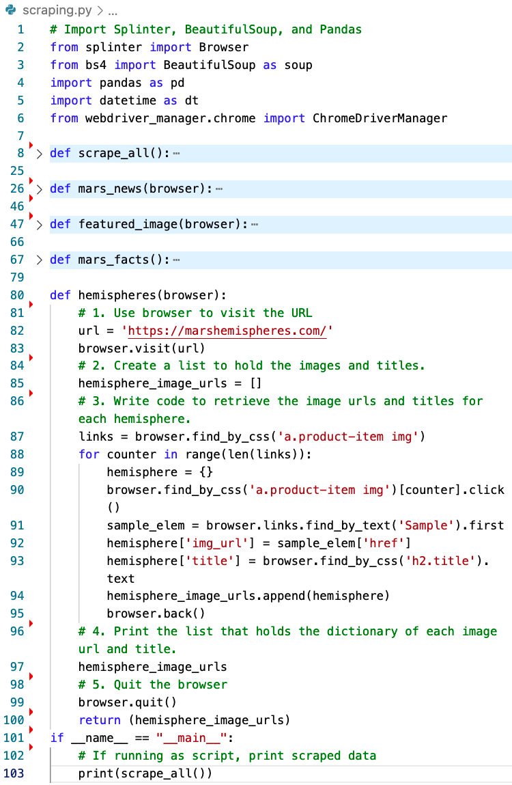
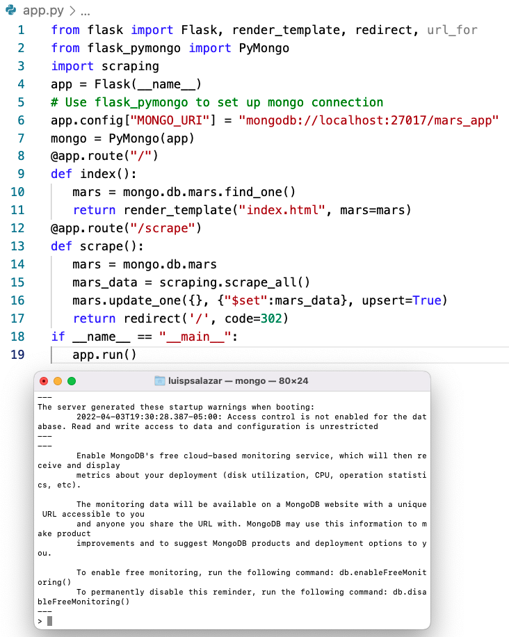
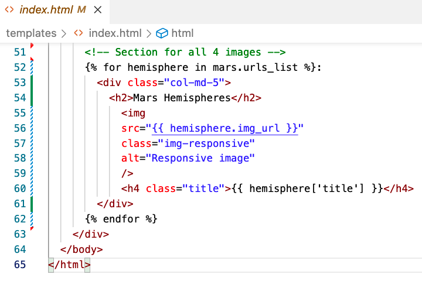
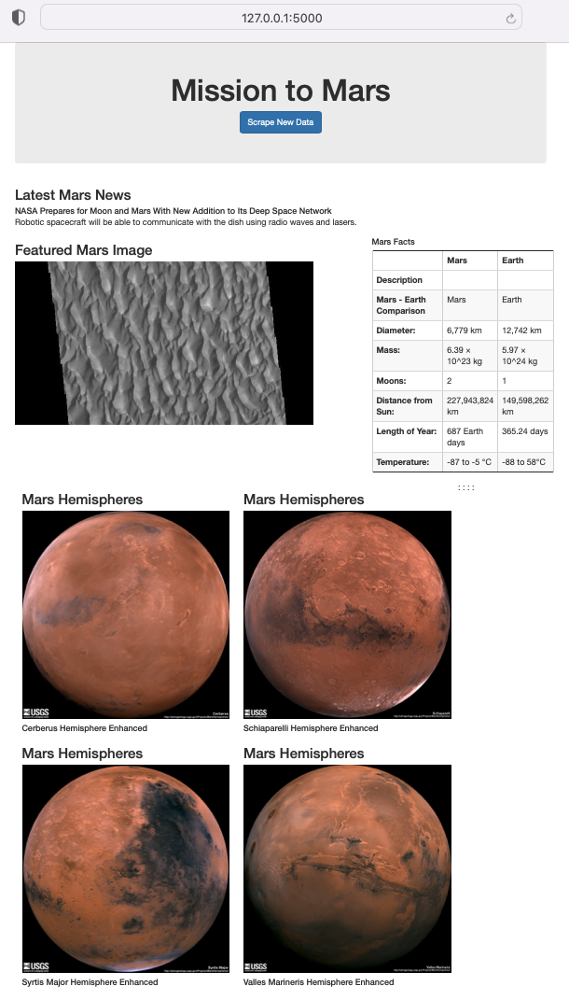
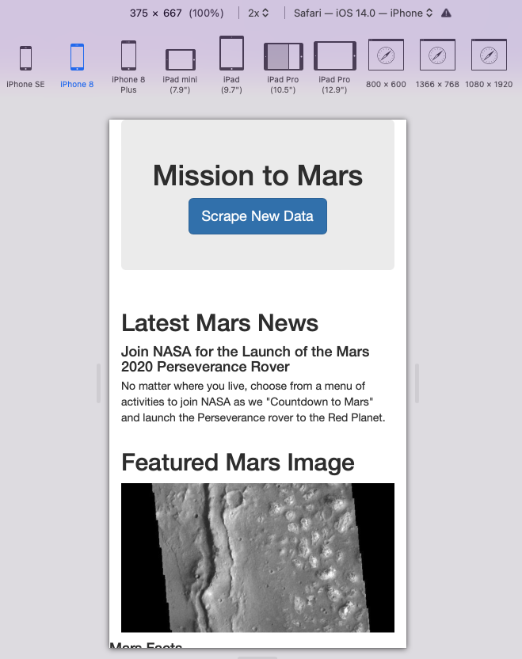
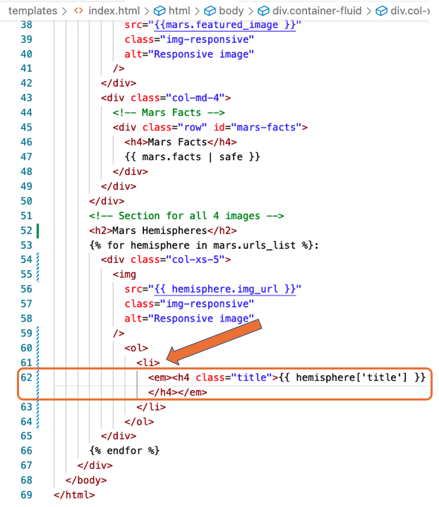

# Mission-to-Mars, Module 10 Challenge

The purpose of this activity is to polish the output of the data scraped from NASA's MARS website.

The images of Mars’ hemispheres are adjusted to the current web app and include all four of the hemisphere images.

With a MAC computer, BeautifulSoup and Splinter are used to scrape full-resolution images of Mars’ hemispheres and the titles of those images, store the scraped data on a Mongo database, use a web application to display the data, and alter the design of the web app to accommodate these images.

The output is responsive to any device, from small mobiles to wide screen monitors.

## Deliverable 1

The code is written to retrieve the full-resolution image and title for each hemisphere image.

The full-resolution images of the hemispheres are added to the dictionary.

The titles for the hemisphere images are added to the dictionary.

The list contains the dictionary of the full-resolution image URL string and title for each hemisphere image.

## Deliverable 2

The "scraping.py" file contains code that retrieves the full-resolution image URL and title for each hemisphere image.

The Mongo database is updated to contain the full-resolution image URL and title for each hemisphere image.

The "index.html" file contains code that will display the full-resolution image URL and title for each hemisphere image.

After the scraping has been completed, the web app contains all the information from this module and the full-resolution images and titles for the four hemisphere images.

## Deliverable 3

The webpage is mobile-responsive.

Two additional Bootstrap 3 components are used to style the webpage:

* Ordered list of itmes "<ul> <li> .... </li> </li>" used in hemispheres' titles
* Italics "<em> </em>" used in hemispheres' titles

